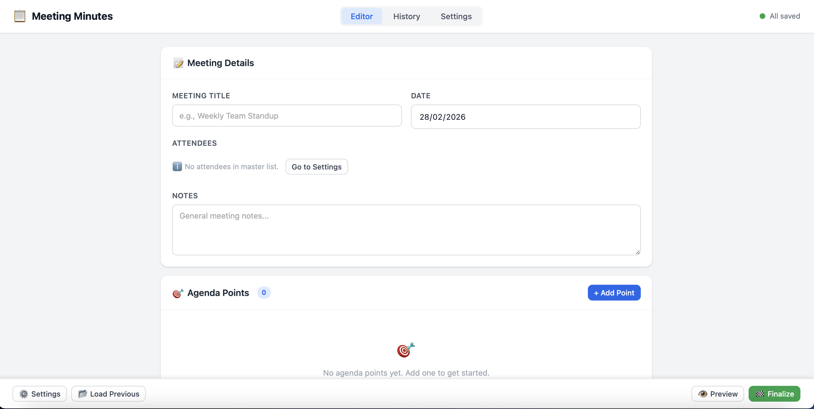

# 📝 Easy Minutes

**Easy Minutes** is a portable meeting minutes application.

It is designed to be:

* 🚀 Portable
* 📂 Easy to duplicate per project or supplier
* 🔒 Storage-isolated
* 🧼 Cache-safe
* ⚡ Lightweight (no build required)

## 📸 Screenshot

<p align="center">
  
</p>

---

## 🏗 Architecture

Easy Minutes follows a strict separation principle:

* `index.html` → UI shell only
* `storage.js` → All persistence logic

### 🔐 Core Rules

* No business data is embedded in `index.html`
* No default attendees, history, or settings are hardcoded
* No fallback persistence exists inside `index.html`
* If `storage.js` is missing, the app will not boot

---

## ✨ Features

### 📅 Meeting Management

* Auto-save draft
* Finalize to create history entry
* Load previous meetings
* Delete history entries
* Preview before finalizing

### 📌 Agenda Points

Each agenda point includes:

* Title
* Description
* Assignee (from master attendee list)
* Deadline
* Status (Open, Resolved, Blocked)
* Automatic countdown (days or calendar weeks)
* Overdue visual indicator

---

### 👥 Attendees Management

Central master list in Settings:

* Name
* Surname
* Company

---

### ⚙️ Settings

* Logo upload (JPEG / PNG)
* Date mode selection (calendar weeks or exact dates)
* Persistent configuration via `storage.js`

---

### 📄 Export

* PDF export available only from History
* Includes:

  * Logo
  * Attendees
  * Agenda points
  * Status
  * Deadlines

---

### ✅ Guarantees

* No data carryover
* No browser cache contamination
* No need to clear browser storage
* No cross-folder leakage
* Same browser can be reused safely

---

## 🚀 Installation

No build system required.

1. Download `index.html`
2. Download `storage.js`
3. Download `db.json`
4. Place both files in the same folder
5. Open `index.html` in your browser
6. Select working folder

---

## 🔄 Boot Behavior

If `storage.js` is missing:

* The app displays a schematic message
* All functionality is disabled
* No data is shown

This prevents accidental data leakage and enforces isolation.

---

## 📖 How to Use

### 1️⃣ Settings

Open Settings:

* Add attendees
* Upload logo
* Choose date mode

All changes persist via `storage.js`.

---

### 2️⃣ Creating a Meeting

* Select attendees
* Add agenda points
* Assign owners
* Set deadlines
* Set status

Draft is saved automatically.

---

### 3️⃣ Finalize

Click **Finalize**:

* Creates history entry
* Clears draft
* Prepares next meeting

Draft is not stored in history until finalized.

---

### 4️⃣ History

From History you can:

* Preview meetings
* Export PDF
* Delete entries
* Load previous meeting

---

## 📁 Project Structure

```
/project-folder
│
├── index.html
├── db.json
└── storage.js
```
