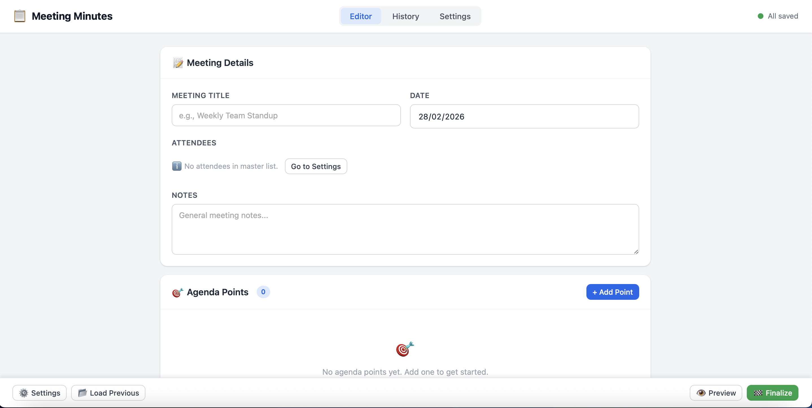

# 📝 Easy Minutes

**Easy Minutes** is a portable meeting minutes application.

* 🚀 Portable
* 📂 Easy to duplicate per project or supplier
* ⚡ Lightweight (no build required)

## 📸 Screenshot

<p align="center">
  
</p>

---

### ✨ Features
* Create and edit meeting minutes with agenda points, attendees, deadlines, and status tracking
* Finalize meetings to history and carry open items forward to the next session
* Export to PDF with customizable accent and background colors
* Manage a master attendee list reusable across meetings

---

### ⚙️ Settings

* Logo upload (JPEG / PNG)
* Date mode selection (calendar weeks or exact dates)

---

### 📖 How to Use

Open index.html in Chrome or Edge. No browser cache, no hidden state, no cross-session references.

---

### 📁 Project Structure

* Google Chrome or Microsoft Edge (version 86+)
* No installation, no build step, no dependencies beyond the three files in the folder

```
/project-folder
│
├── index.html
```
